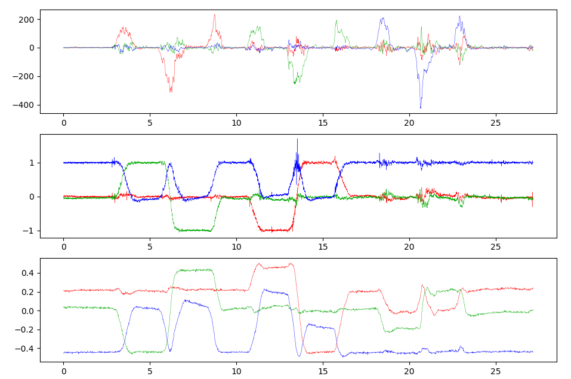
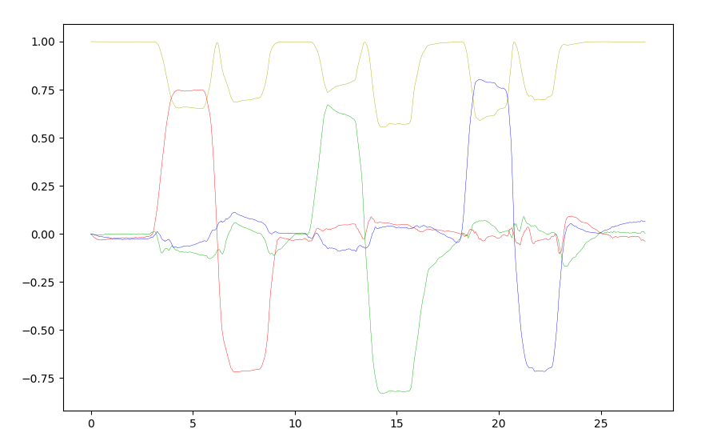

# AHRS: Attitude and Heading Reference Systems

AHRS is a zoo of functions and objects written in Python helping you to estimate the orientation and position of robotic systems.

Orginally, an [AHRS](https://en.wikipedia.org/wiki/Attitude_and_heading_reference_system) is defined as a set of orthogonal sensors providing attitude information about an aircraft. This field is now expanding to smaller devices, like wearables, automated transportation and all kinds of robots in motion.

The module __AHRS__ is developed with a focus on fast prototyping and easy modularity.

AHRS is compatible with __Python 3.6__ and above.

## Installation

AHRS may be installed using [pip](https://pip.pypa.io):

```sh
pip install ahrs
```

Or directly from the repository:

```sh
git clone https://github.com/Mayitzin/ahrs.git
cd ahrs
python setup.py install
```

AHRS depends on the most distributed packages of Python. If you don't have them, they will be automatically downloaded and installed.

## Using AHRS

To play with orientations, for example, we can use the `orientation` module.

```py
>>> import ahrs
>>> # Rotation matrix of 30.0 degrees around X-axis
... ahrs.common.orientation.rotation('x', 30.0)
array([[ 1.       ,  0.       ,  0.       ],
       [ 0.       ,  0.8660254, -0.5      ],
       [ 0.       ,  0.5      ,  0.8660254]])
>>> # Rotation sequence of the form: R_y(10.0)@R_x(20.0)@R_y(30.0)
... ahrs.common.orientation.rot_seq('yXy', [10.0, 20.0, 30.0])
array([[ 0.77128058,  0.05939117,  0.63371836],
       [ 0.17101007,  0.93969262, -0.29619813],
       [-0.61309202,  0.33682409,  0.71461018]])
```

It also works nicely with Quaternions.

```py
>>> import numpy as np
>>> q = np.random.random(4)
>>> # It automatically normalizes any given vector
... ahrs.common.orientation.q2R(q)
array([[ 0.76811067,  0.3546719 ,  0.53311709],
       [ 0.55044928,  0.05960693, -0.83273802],
       [-0.32712625,  0.93308888, -0.14944417]])
```

`ahrs` also includes a module that simplifies data loading and visualization

```py
>>> data = ahrs.utils.io.load("ExampleData.mat")
>>> ahrs.utils.plot_sensors(data.gyr, data.acc, data.mag)
```



If you want to use the sensor data to estimate the attitude, use the `filters` module that includes various (more coming) algorithms for it.

```py
>>> madgwick = ahrs.filters.Madgwick()
>>> Q = np.tile([1., 0., 0., 0.], (data.num_samples, 1)) # Allocate an array for all quaternions
>>> d2g = ahrs.common.DEG2RAD   # Constant to convert degrees to radians
>>> for t in range(1, data.num_samples):
...     Q[t] = madgwick.updateMARG(d2g*data.gyr[t], data.acc[t], data.mag[t], Q[t-1])
...
>>> ahrs.utils.plot_quaternions(Q)
```



It also works by simply passing the data to a desired filter, and it will automatically compute the quaternion with the given parameters.

```py
>>> filtered = ahrs.filters.Madgwick(data, beta=0.01, frequency=freq)
>>> ahrs.utils.plot_quaternions(filtered.Q)
```

## Documentation

A comprehensive documentation, with examples, will soon come to [Read the Docs](https://docs.readthedocs.io/).
